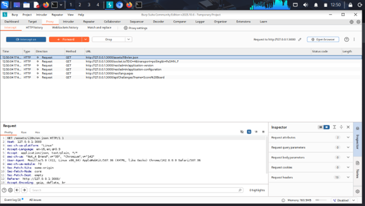
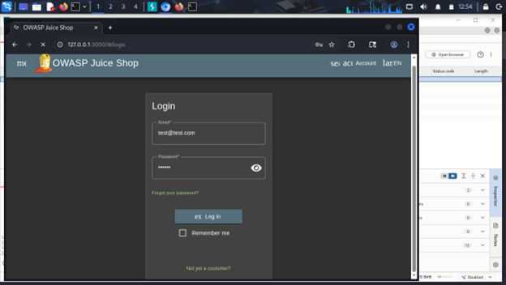
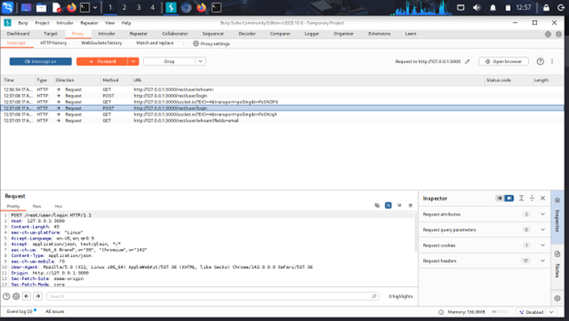
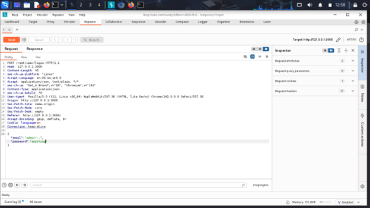
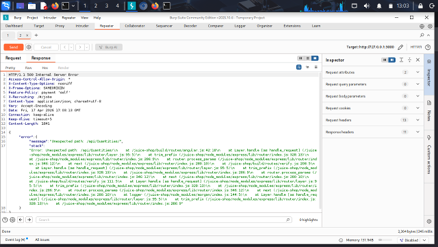

# 🔐 API Security Testing using Burp Suite (OWASP Juice Shop)

## 📌 Overview

This project demonstrates hands-on API security testing on OWASP Juice Shop using Burp Suite. The goal was to understand how APIs work, intercept requests, modify them, and identify potential vulnerabilities.


## 🎯 Objectives

* Capture API requests using Burp Suite
* Analyze and manipulate request/response data
* Test authentication mechanisms
* Identify security issues in APIs


## 🛠️ Tools & Environment

* Kali Linux (Virtual Machine)
* Burp Suite Community Edition
* Firefox Browser
* OWASP Juice Shop


## 🔍 Testing Workflow

### 1️⃣ Intercepting Requests

All HTTP traffic was routed through Burp Suite to capture API requests.




### 2️⃣ Login Page Interaction

User login action was performed to trigger API calls.




### 3️⃣ API Discovery

Captured the login API endpoint:

```
POST /rest/user/login
```



---

### 4️⃣ Request Manipulation

Modified login payload to test authentication handling.

```
email: admin'--
password: anything
```




### 5️⃣ Vulnerability Identification

Tested API endpoint manipulation:

```
GET /api/Quantities/1
```

Observed:

* HTTP 500 Internal Server Error
* Stack trace exposed




## 🚨 Key Finding

### Improper Error Handling (Information Disclosure)

* Server returns internal stack trace
* Reveals backend implementation details
* Can assist attackers in further exploitation

**Severity:** Medium
**Related to:** OWASP API Security Top 10


## 💡 Recommendations

* Disable detailed error messages in production
* Implement proper exception handling
* Log errors internally instead of exposing them


## 📚 Learning Outcomes

* Practical experience with API interception
* Understanding of request/response manipulation
* Exposure to real-world vulnerability patterns
* Hands-on use of Burp Suite


## 📄 Report

Detailed report available in:
`API Security Testing Report.pdf`


## 🚀 Conclusion

This project demonstrates practical API security testing skills using industry tools and real-world vulnerability analysis.


